# OpenManus Flow 模式与 Agent 状态流转综合解析

## 引言

OpenManus 框架采用了先进的 AI 代理执行模型，其核心包括两种关键模式：**Agent 模式**和 **Flow 模式**。本文将详细解析这两种模式的工作原理、状态流转机制、消息处理流程以及它们之间的关系，帮助开发者深入理解 OpenManus 的内部运作机制。

## 一、核心概念对比

### Agent 模式 vs Flow 模式

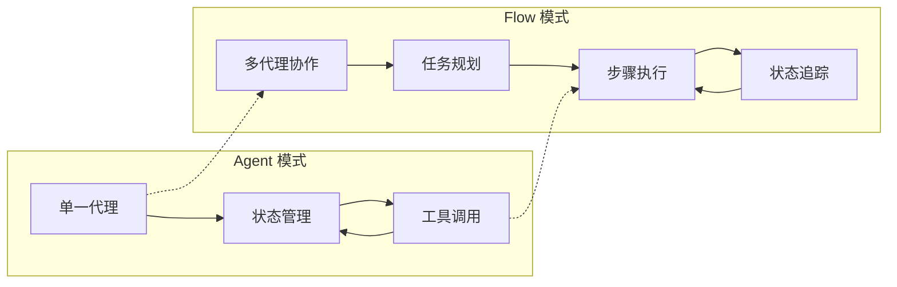

| 特性 | Agent 模式 | Flow 模式 |
|------|------------|------------|
| 执行单元 | 单一 Agent | 多个协作 Agent |
| 任务处理 | 整体处理 | 分步规划与执行 |
| 状态管理 | 内部状态机 | 计划步骤状态 |
| 适用场景 | 单一明确任务 | 复杂多步骤任务 |

## 二、Agent 状态流转详解

### 1. 状态定义

Manus Agent 采用状态机设计模式，包含以下核心状态：

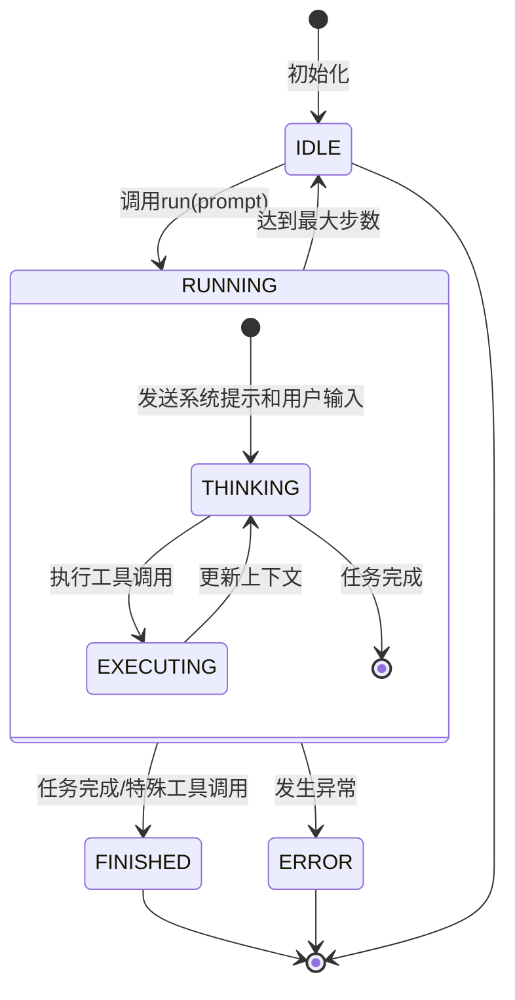

### 2. 状态转换触发条件

| 状态转换 | 触发条件 |
|---------|----------|
| IDLE → RUNNING | 调用 `agent.run(prompt)` |
| RUNNING → THINKING | 开始分析用户输入或上下文 |
| THINKING → EXECUTING | LLM 返回工具调用建议 |
| EXECUTING → THINKING | 工具执行完成，更新上下文 |
| RUNNING → FINISHED | 执行特殊工具（如 Terminate）或任务完成 |
| RUNNING → ERROR | 执行过程中发生异常 |
| RUNNING → IDLE | 达到最大执行步数 |

### 3. 代码实现

Agent 状态管理的核心实现（伪代码）：

```python
async def run(self, prompt: str) -> str:
    # 初始化内存和状态
    self.memory.add_user_message(prompt)
    self.state = AgentState.RUNNING

    # 执行步骤循环
    for step in range(self.max_steps):
        try:
            # 思考阶段
            self.state = AgentState.THINKING
            messages = self._build_messages()
            response = await self.llm.ask_tool(messages, tools=self.tools)
            self.memory.add_assistant_message(response)

            # 执行阶段
            self.state = AgentState.EXECUTING
            tool_result = await self._execute_tool(response.tool_calls)
            self.memory.add_tool_message(tool_result)

            # 检查特殊工具
            if self._is_special_tool(tool_name):
                self.state = AgentState.FINISHED
                return self._format_result()

        except Exception as e:
            self.state = AgentState.ERROR
            return f"Error: {str(e)}"

    # 达到最大步数
    self.state = AgentState.IDLE
    return self._format_result()
```

## 三、Flow 模式工作机制

### 1. 基础架构

Flow 模式基于 `BaseFlow` 抽象类，支持多个 Agent 协作：

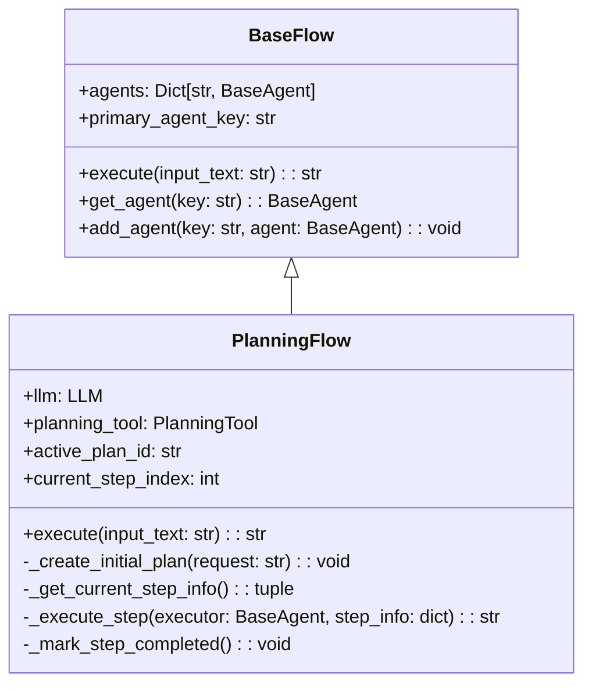

### 2. 执行流程

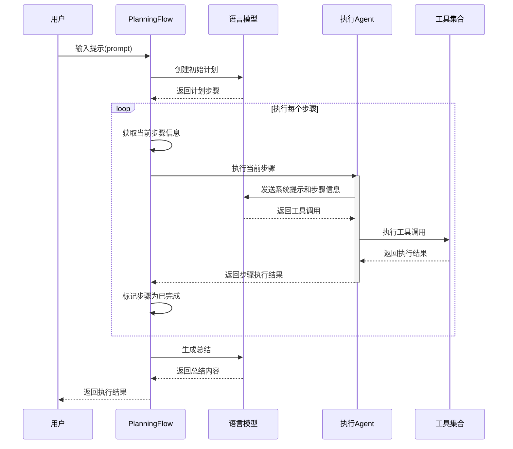

### 3. 计划步骤状态管理

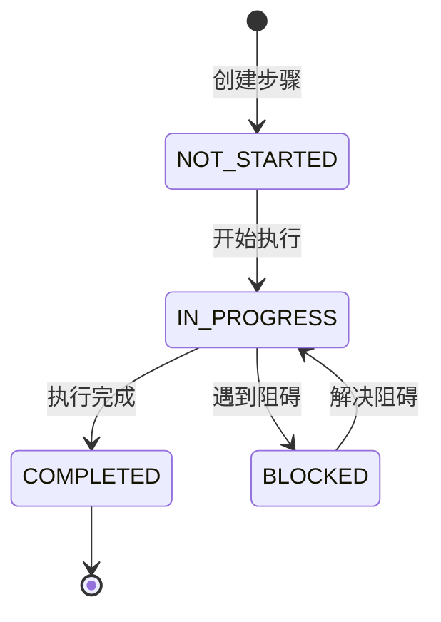

## 四、消息处理机制

### 1. 消息类型与结构

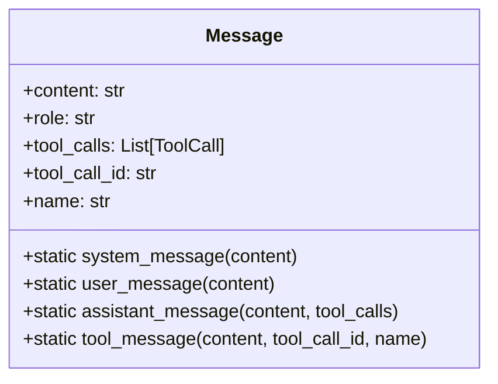

### 2. 消息构建过程

在 Agent 的思考阶段(THINKING)，消息构建过程如下：

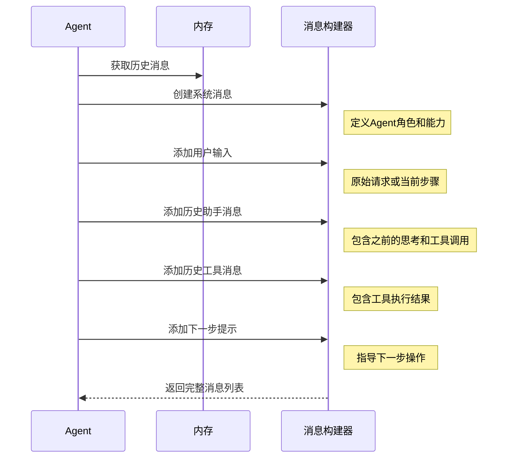

### 3. 消息示例

```python
# 系统提示
Message.system_message("You are OpenManus, an all-capable AI assistant...")

# 用户输入
Message.user_message("创建一个简单的Python计算器，支持加减乘除操作")

# 助手消息(含工具调用)
Message.assistant_message("我将使用PythonExecute工具创建一个计算器", tool_calls=[...])

# 工具消息
Message.tool_message("成功创建了calculator.py文件", tool_call_id="...", name="PythonExecute")

# 下一步提示
Message.user_message("Based on user needs, proactively select the most appropriate tool...")
```

## 五、工具调用流程

### 1. 工具调用架构

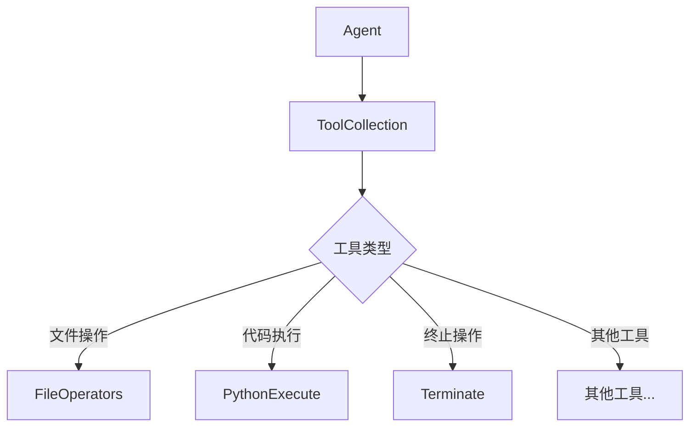

### 2. 工具调用执行流程

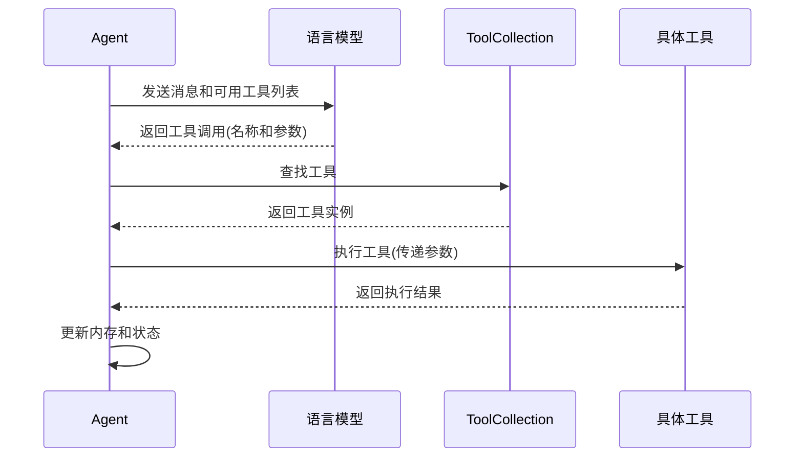

## 六、Flow 模式与 Agent 模式的集成

### 1. 集成架构

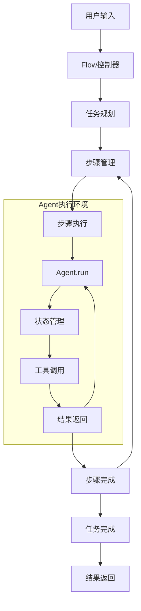

### 2. 执行流程

在 Flow 模式中，每个步骤的执行都会触发 Agent 的完整状态流转：

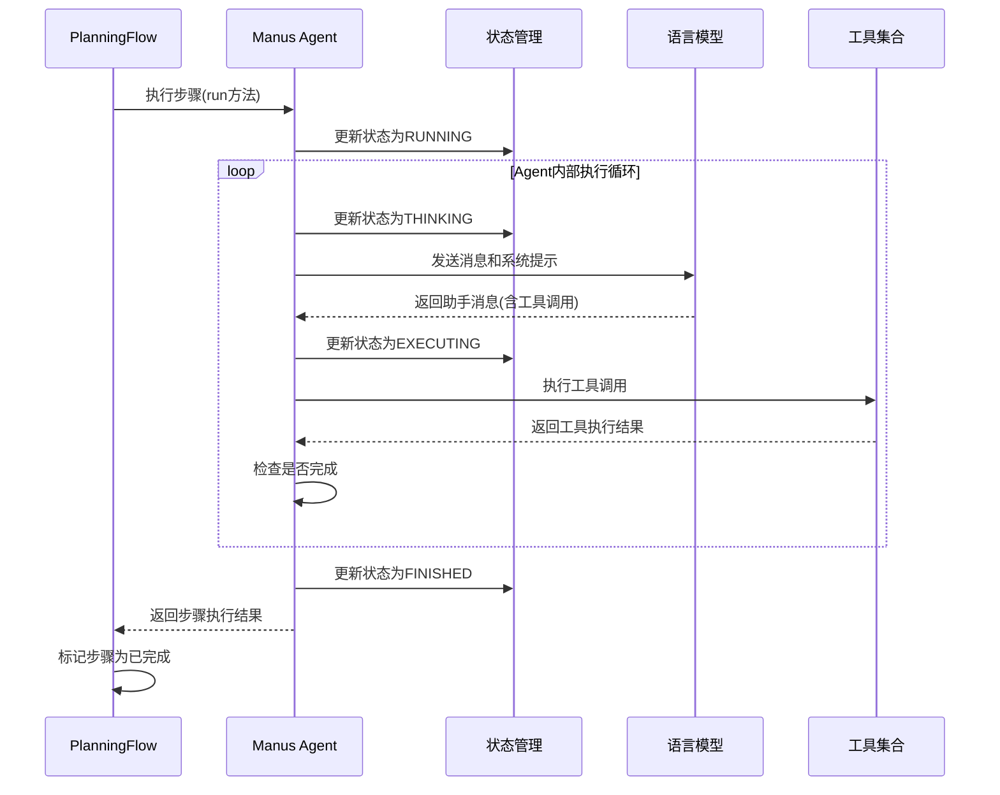

## 七、实际应用示例

### 1. Python计算器示例

以下是使用 Flow 模式处理「创建一个简单的Python计算器」任务的完整流程：

1. **用户输入处理**
   - 用户输入: "创建一个简单的Python计算器，支持加减乘除操作"
   - Flow 接收输入并开始执行

2. **计划创建**
   - Flow 调用 LLM 创建初始计划
   - 生成计划步骤：
     1. 分析需求，确定功能
     2. 创建基本计算函数
     3. 实现用户界面
     4. 测试功能

3. **步骤执行**
   - **步骤1：分析需求**
     - Flow 选择合适的 Agent 执行
     - Agent 进入 RUNNING 状态
     - Agent 分析需求并返回结果
     - Flow 标记步骤为已完成

   - **步骤2：创建基本计算函数**
     - Agent 进入 THINKING 状态
     - LLM 建议使用 PythonExecute 工具
     - Agent 进入 EXECUTING 状态
     - 执行工具，创建计算函数
     - Flow 标记步骤为已完成

   - **步骤3：实现用户界面**
     - 类似流程，实现用户交互界面
     - Flow 标记步骤为已完成

   - **步骤4：测试功能**
     - Agent 测试计算器功能
     - 返回测试结果
     - Flow 标记步骤为已完成

4. **任务完成**
   - Flow 生成执行总结
   - 返回最终结果给用户

## 八、技术实现细节

### 1. 状态管理实现

Agent 状态管理的核心是通过枚举类型定义状态，并在执行过程中更新状态：

```python
class AgentState(str, Enum):
    IDLE = "idle"
    RUNNING = "running"
    THINKING = "thinking"
    EXECUTING = "executing"
    FINISHED = "finished"
    ERROR = "error"
```

### 2. 消息处理实现

消息处理通过 Memory 类管理，它维护了一个消息历史列表：

```python
class Memory:
    def __init__(self):
        self.messages = []

    def add_user_message(self, content):
        self.messages.append(Message.user_message(content))

    def add_assistant_message(self, response):
        self.messages.append(Message.assistant_message(
            content=response.content,
            tool_calls=response.tool_calls
        ))

    def add_tool_message(self, result, tool_call_id, tool_name):
        self.messages.append(Message.tool_message(
            content=result,
            tool_call_id=tool_call_id,
            name=tool_name
        ))
```

### 3. Flow 与 Agent 的交互实现

Flow 通过调用 Agent 的 run 方法执行步骤：

```python
async def _execute_step(self, executor: BaseAgent, step_info: dict) -> str:
    # 准备上下文
    plan_status = await self._get_plan_text()
    step_text = step_info.get("text", f"Step {self.current_step_index}")

    # 创建提示
    step_prompt = f"""
    CURRENT PLAN STATUS:
    {plan_status}

    YOUR CURRENT TASK:
    You are now working on step {self.current_step_index}: "{step_text}"

    Please execute this step using the appropriate tools.
    """

    # 使用 agent.run() 执行步骤
    step_result = await executor.run(step_prompt)
    return step_result
```

## 九、总结

OpenManus 的 Flow 模式和 Agent 状态流转机制共同构成了一个强大的 AI 代理执行框架。通过状态机设计、结构化消息处理和工具调用机制，实现了复杂任务的规划和执行。

- **Agent 模式**专注于单一代理的状态管理和工具调用，适合处理明确的单一任务。
- **Flow 模式**提供了多代理协作的框架，通过任务规划和步骤执行，适合处理复杂的多步骤任务。

这两种模式相互补充，共同提高了 OpenManus 处理各种任务的能力和灵活性。通过明确的状态定义和结构化的消息处理，使得 AI 代理的行为更加可预测和可控，同时保持了足够的灵活性来应对各种任务场景。
