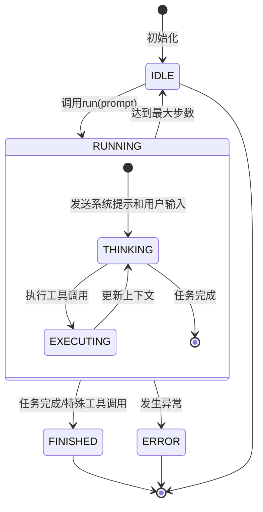
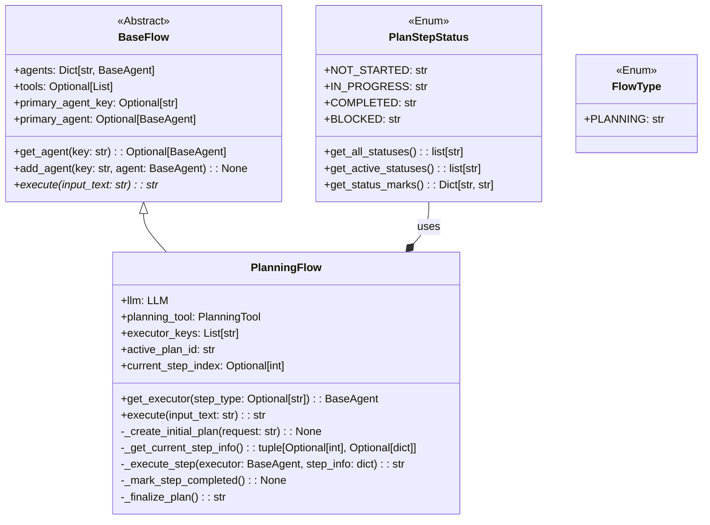
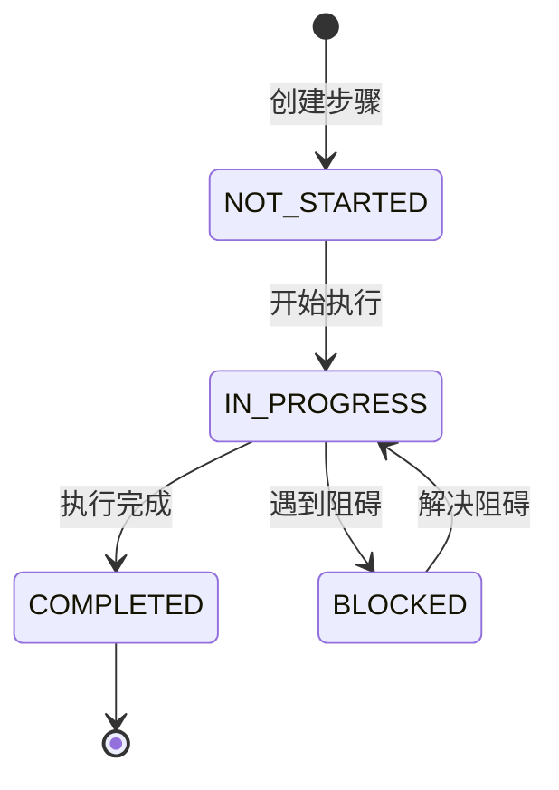
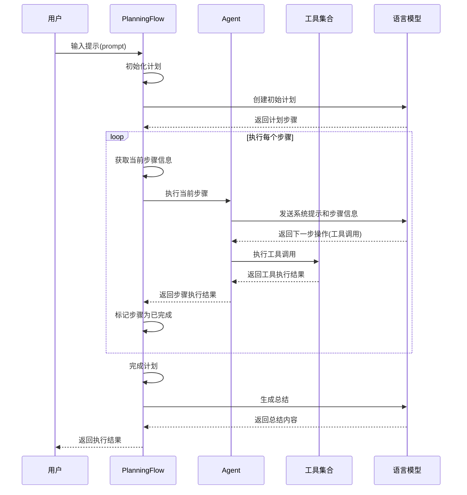

# OpenManus Flow 模式详解

## 概述

OpenManus 的 Flow 模式是一种高级的执行流程管理机制，它允许多个 Agent 协同工作，以完成复杂的任务。Flow 模式采用状态机设计模式，通过明确定义的状态流转和消息处理机制，实现了任务的规划、执行和监控。

## 核心概念

### 1. 基础架构

Flow 模式的核心是 `BaseFlow` 抽象类，它定义了所有流程的基本接口和属性：

- **agents**: 管理多个 Agent 的字典集合
- **primary_agent**: 主要 Agent，负责核心决策
- **execute()**: 执行流程的抽象方法

### 2. 状态流转

Agent 在执行过程中会经历多个状态：



### 3. 消息处理机制

Flow 模式中的消息处理是通过一系列结构化的消息对象实现的：

- **系统提示 (System Message)**: 定义 Agent 的角色和能力
- **用户输入 (User Message)**: 用户的原始请求
- **助手消息 (Assistant Message)**: 包含 Agent 的思考和工具调用信息
- **工具消息 (Tool Message)**: 包含工具执行的结果
- **下一步提示 (Next Step Prompt)**: 指导 Agent 决定下一步操作

## PlanningFlow 实现

`PlanningFlow` 是 Flow 模式的一个具体实现，它专注于任务的规划和执行。

### 0. 类图



### 1. 规划步骤状态

每个规划步骤都有明确的状态：



### 2. 执行流程



## 代码实现细节

### 1. 流程工厂 (FlowFactory)

`FlowFactory` 负责创建不同类型的流程实例：

```python
class FlowFactory:
    @staticmethod
    def create_flow(flow_type: FlowType, agents, **kwargs) -> BaseFlow:
        flows = {
            FlowType.PLANNING: PlanningFlow,
        }
        flow_class = flows.get(flow_type)
        return flow_class(agents, **kwargs)
```

### 2. 计划创建与执行

`PlanningFlow` 的执行过程包括以下关键步骤：

1. **创建初始计划**：通过 LLM 和 PlanningTool 创建任务计划
2. **获取当前步骤**：识别下一个需要执行的步骤
3. **执行步骤**：使用适当的 Agent 执行当前步骤
4. **标记步骤完成**：更新步骤状态
5. **完成计划**：生成执行总结

#### 2.1 创建初始计划
提示词：
```python
system_message = Message.system_message(
"You are a planning assistant. Create a concise, actionable plan with clear steps. "
"Focus on key milestones rather than detailed sub-steps. "
"Optimize for clarity and efficiency."
)

# Create a user message with the request
user_message = Message.user_message(
f"Create a reasonable plan with clear steps to accomplish the task: {request}"
)
```
会请求模型，生成有milestones plan，使用plaing tool管理planning。
例子：
```python
await self.planning_tool.execute(
**{
    "command": "create",
    "plan_id": self.active_plan_id,
    "title": f"Plan for: {request[:50]}{'...' if len(request) > 50 else ''}",
    "steps": ["Analyze request", "Execute task", "Verify results"],
}
)
```
```plaintext
[manus] 搜集和整理AI Agent相关的信息和资料
[ ] 分析并总结AI Agent的模式、常见应用及写作方式
[ ] 设计一个逻辑清晰、易于理解的教学内容结构
[ ] 制作教学内容，确保信息准确且通俗易懂
[ ] 设计并实现一个HTML页面用于展示教学内容
```
[]指定agent，没有则使用第一个agent。

### Step 1 agnet prompt:

```

        CURRENT PLAN STATUS:
        Plan: 使用网页介绍AI Agent相关知识 (ID: plan_1744904337)
===============================================

Progress: 0/7 steps completed (0.0%)
Status: 0 completed, 1 in progress, 0 blocked, 6 not started

Steps:
0. [→] 研究和收集关于AI Agent的相关资料和知识点
1. [ ] 制定内容大纲，确定网页结构和布局
2. [ ] 编写网页内容，确保信息准确且易于理解
3. [ ] 设计网页的视觉效果，包括颜色、字体和图像的选择
4. [ ] 开发网页，集成所有内容和设计元素
5. [ ] 进行网页测试，确保所有链接和功能正常运作
6. [ ] 发布网页，并在社交媒体和其他渠道上推广


        YOUR CURRENT TASK:
        You are now working on step 0: "研究和收集关于AI Agent的相关资料和知识点"

        Please execute this step using the appropriate tools. When you're done, provide a summary of what you accomplished.
```


### 3. 与 Agent 的交互

`PlanningFlow` 通过以下方式与 Agent 交互：

```python
async def _execute_step(self, executor: BaseAgent, step_info: dict) -> str:
    # 准备上下文
    plan_status = await self._get_plan_text()
    step_text = step_info.get("text", f"Step {self.current_step_index}")

    # 创建提示
    step_prompt = f"""
    CURRENT PLAN STATUS:
    {plan_status}

    YOUR CURRENT TASK:
    You are now working on step {self.current_step_index}: "{step_text}"

    Please execute this step using the appropriate tools.
    """

    # 使用 agent.run() 执行步骤
    step_result = await executor.run(step_prompt)
    return step_result
```

## 与传统 Agent 模式的比较

### Flow 模式的优势

1. **结构化任务处理**：将复杂任务分解为可管理的步骤
2. **多 Agent 协作**：支持不同专长的 Agent 协同工作
3. **状态追踪**：明确的状态管理，便于监控和调试
4. **灵活性**：可以根据需要动态选择执行 Agent

### 适用场景

- **复杂任务**：需要多步骤规划和执行的任务
- **长期运行**：需要持续跟踪进度的长期任务
- **协作场景**：需要多个专业 Agent 协作的场景

## 实际应用示例

以下是一个使用 Flow 模式的简单示例：

```python
async def run_flow():
    agents = {
        "manus": Manus(),  # 通用 Agent
    }

    flow = FlowFactory.create_flow(
        flow_type=FlowType.PLANNING,
        agents=agents,
    )

    result = await flow.execute("创建一个简单的Python计算器")
    print(result)
```

## 总结

OpenManus 的 Flow 模式提供了一种强大的任务管理机制，通过状态流转、消息处理和工具调用的协同工作，实现了复杂任务的规划和执行。它不仅提高了 Agent 处理复杂任务的能力，还为多 Agent 协作提供了坚实的基础。

通过明确的状态定义和结构化的消息处理，Flow 模式使得 Agent 的行为更加可预测和可控，同时保持了足够的灵活性来应对各种任务场景。
