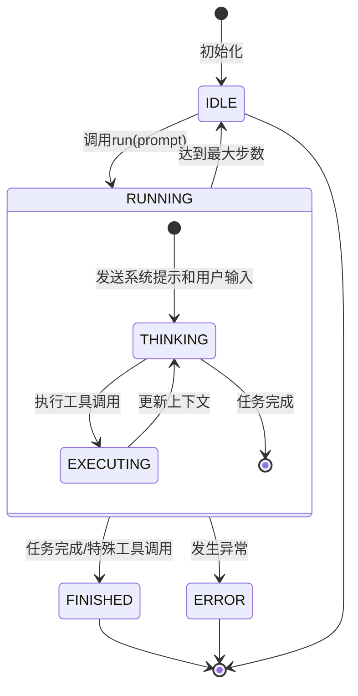
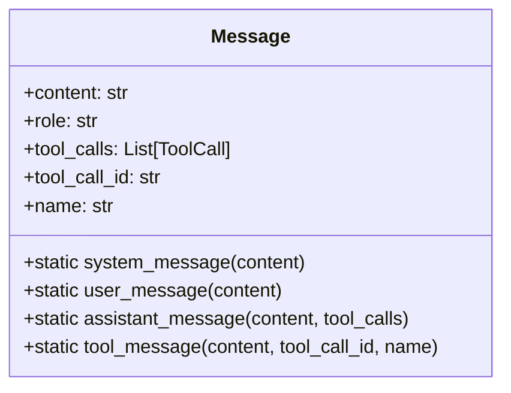
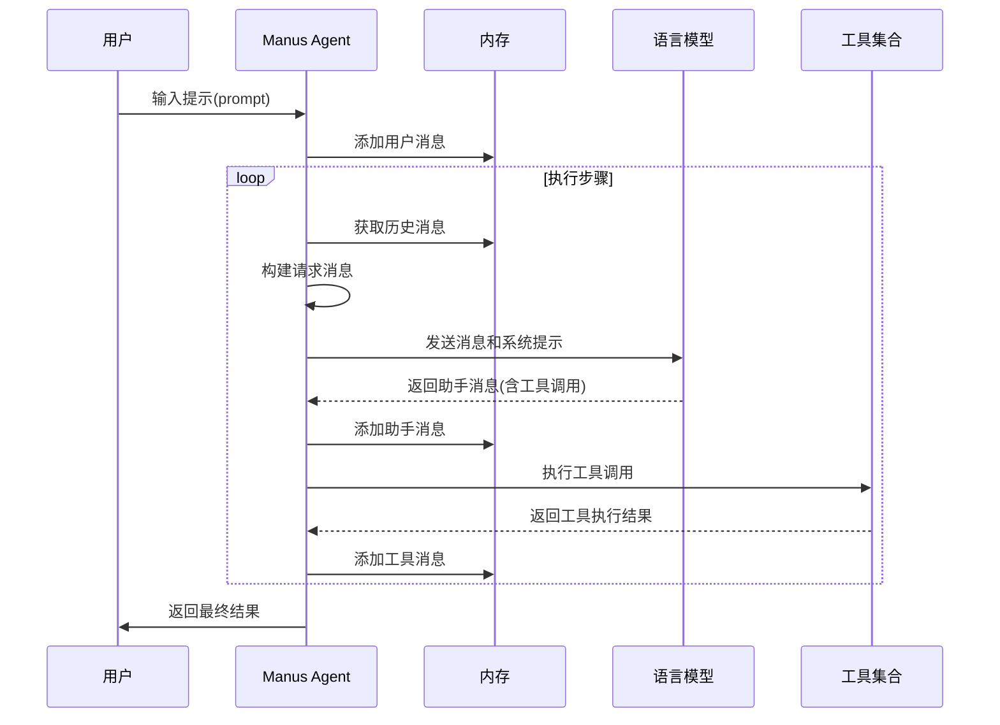
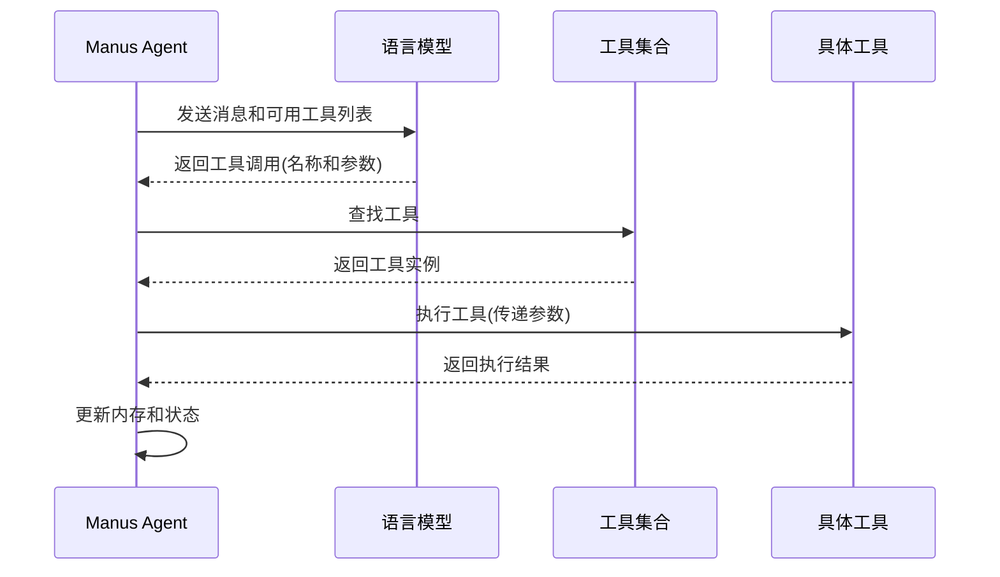
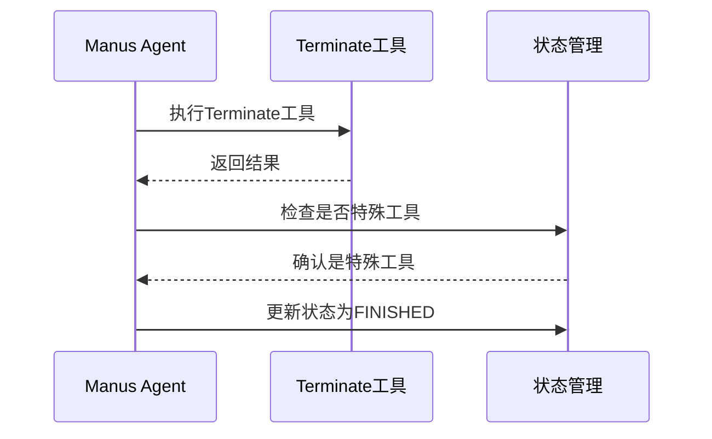
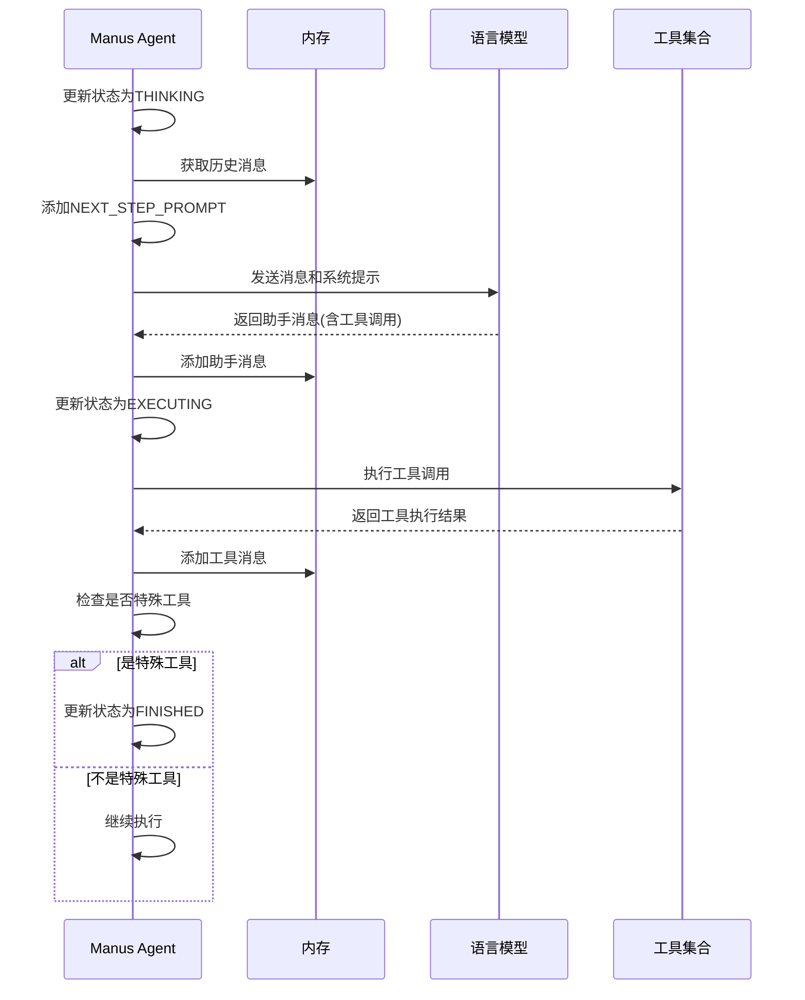
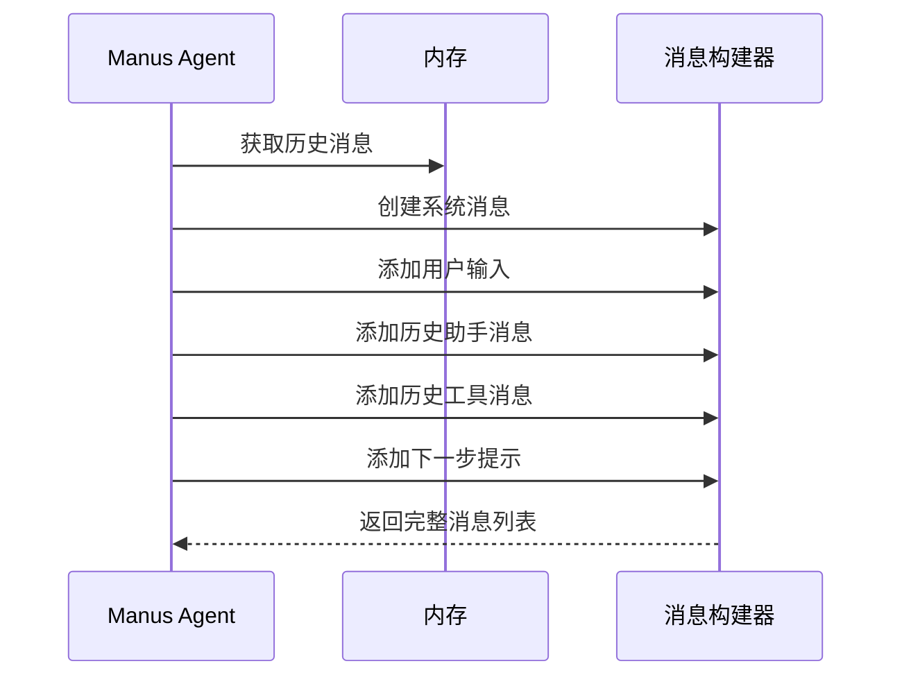
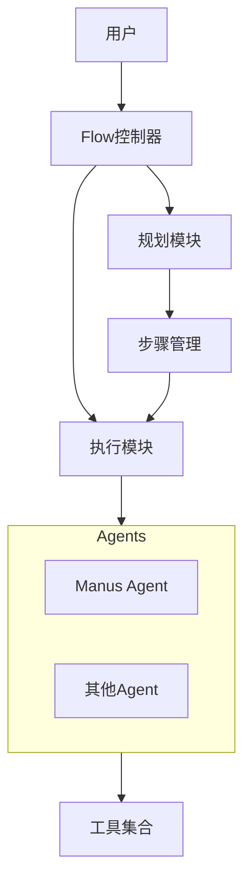
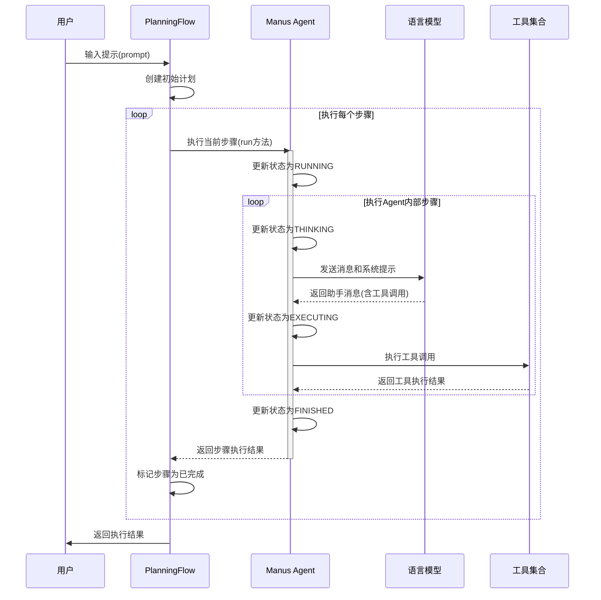

# Manus Agent 状态流转与消息处理详解

## 1. Manus Agent 状态机模型

Manus Agent 采用状态机设计模式，通过明确定义的状态和转换规则，实现了任务的规划、执行和监控。

### 1.1 核心状态定义

Manus Agent 的状态机包含以下核心状态：

- **IDLE**：初始状态，Agent 等待任务输入
- **RUNNING**：Agent 正在处理任务
  - **THINKING**：Agent 正在分析信息并决定下一步行动
  - **EXECUTING**：Agent 正在执行工具调用
- **FINISHED**：任务已完成
- **ERROR**：执行过程中发生错误

### 1.2 状态流转详细图解

## 2. 消息处理机制

Manus Agent 的消息处理机制是其核心功能之一，它通过结构化的消息对象管理与语言模型的交互。

### 2.1 消息类型

### 2.2 消息流转过程

## 3. 工具调用流程

工具调用是 Manus Agent 执行具体操作的方式，它通过标准化的接口与各种工具交互。

### 3.1 工具调用流程

### 3.2 特殊工具处理

某些特殊工具（如 Terminate）会触发状态转换：

## 4. 执行步骤详解

### 4.1 单步执行流程

### 4.2 请求消息构建

在每个思考阶段(THINKING)，Agent 会构建请求消息：

## 5. 与 Flow 模式的集成

Manus Agent 可以作为 Flow 模式中的执行单元，参与复杂任务的处理。

### 5.1 集成架构

### 5.2 执行流程

## 6. 实际应用示例

### 6.1 Python计算器示例

以下是 Manus Agent 处理「创建一个简单的Python计算器」任务的状态流转示例：

1. **初始状态 (IDLE)**
   - Manus Agent 初始化，状态为 IDLE
   - 用户输入: "创建一个简单的Python计算器，支持加减乘除操作"

2. **开始执行 (RUNNING)**
   - 调用 `agent.run(prompt)`
   - 用户输入被添加到内存

3. **思考阶段 (THINKING)**
   - 构建请求消息，包含系统提示和用户输入
   - 调用LLM，获取工具调用建议
   - LLM返回使用PythonExecute工具创建计算器代码的建议
   - 更新内存，添加助手消息

4. **执行阶段 (EXECUTING)**
   - 执行PythonExecute工具调用，创建计算器代码
   - 工具执行结果添加到内存

5. **再次思考 (THINKING)**
   - 构建新的请求消息，包含历史消息和下一步提示
   - 调用LLM，获取下一步建议
   - LLM返回使用Terminate工具表示任务完成的建议

6. **完成任务 (FINISHED)**
   - 执行Terminate工具调用
   - 检测到特殊工具，更新状态为FINISHED
   - 返回执行结果

## 7. 总结

Manus Agent 的状态流转和消息处理机制是其核心功能，通过明确的状态定义和结构化的消息处理，实现了复杂任务的规划和执行。它不仅可以独立工作，还可以作为 Flow 模式中的执行单元，参与更复杂的任务处理。

状态机设计使得 Agent 的行为更加可预测和可控，而结构化的消息处理则提供了与语言模型交互的标准接口。这种设计不仅提高了 Agent 的可靠性和可维护性，还为未来的扩展提供了坚实的基础。
