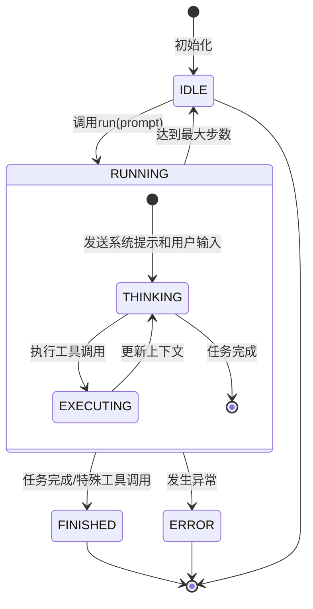
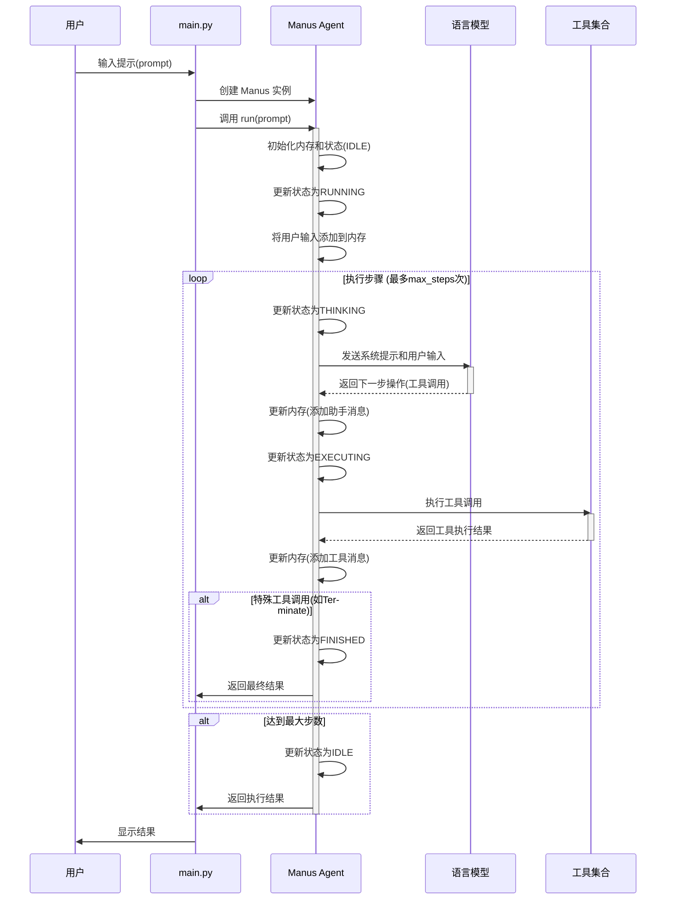

# Manus Agent 状态流转流程图

## 状态流转图



## 详细执行流程



## Manus Agent 状态流转示例

以下是一个具体示例，展示了Manus Agent如何处理用户请求并进行状态流转：

### 示例：用户请求创建一个简单的Python计算器

1. **初始状态 (IDLE)**
   - Manus Agent 初始化，状态为 IDLE
   - 用户输入: "创建一个简单的Python计算器，支持加减乘除操作"

2. **开始执行 (RUNNING)**
   - main.py 调用 `agent.run(prompt)`
   - 用户输入被添加到内存: `Message.user_message("创建一个简单的Python计算器，支持加减乘除操作")`

3. **思考阶段 (THINKING)**
   - 构建请求模型的message:
     ```python
     messages = [
      Message.user_message("创建一个简单的Python计算器，支持加减乘除操作")  # 用户输入,
         Message.user_message(NEXT_STEP_PROMPT)
     ]
     ```
   - 调用LLM: `llm.ask_tool(messages=messages, system_msgs, tools=available_tools.to_params())`
   - LLM返回工具调用: 使用PythonExecute工具创建计算器代码，返回工具名称和参数（此例参数为计算器程序代码）
   ```
   ChatCompletionMessage(content='', refusal=None, role='assistant', annotations=None, audio=None, function_call=None, tool_calls=[ChatCompletionMessageToolCall(id='call_57260d0edbe042c391a41f', function=Function(arguments='{"command": "create", "path": "C:\\\\Users\\\\fanghongbin\\\\OpenManus\\\\workspace\\\\simple_calculator.py", "file_text": "def add(x, y):\\n    \\"\\"\\"加法\\"\\"\\"\\n    return x + y\\n\\ndef subtract(x, y):\\n    \\"\\"\\"减法\\"\\"\\"\\n    return x - y\\n\\ndef multiply(x, y):\\n    \\"\\"\\"乘法\\"\\"\\"\\n    return x * y\\n\\ndef divide(x, y):\\n    \\"\\"\\"除法，注意除数不能为0\\"\\"\\"\\n    if y == 0:\\n        raise ValueError(\\"除数不能为0\\")\\n    return x / y\\n\\n# 测试代码\\ndef main():\\n    print(\\"选择操作：\\")\\n    print(\\"1.加法\\")\\n    print(\\"2.减法\\")\\n    print(\\"3.乘法\\")\\n    print(\\"4.除法\\")\\n\\n    choice = input(\\"输入你的选择(1/2/3/4): \\")\\n\\n    num1 = float(input(\\"输入第一个数字: \\"))\\n    num2 = float(input(\\"输入第二个数字: \\"))\\n\\n    if choice == \'1\':\\n        print(f\\"{num1} + {num2} = {add(num1, num2)}\\")\\n    elif choice == \'2\':\\n        print(f\\"{num1} - {num2} = {subtract(num1, num2)}\\")\\n    elif choice == \'3\':\\n        print(f\\"{num1} * {num2} = {multiply(num1, num2)}\\")\\n    elif choice == \'4\':\\n        try:\\n            print(f\\"{num1} / {num2} = {divide(num1, num2)}\\")\\n        except ValueError as e:\\n            print(e)\\n    else:\\n        print(\\"非法输入\\")\\n\\nif __name__ == \\"__main__\\":\\n    main()"}', name='str_replace_editor'), type='function', index=0)])
   ```
   - 更新内存: 添加助手消息(包含工具调用信息)

4. **执行阶段 (EXECUTING)**
   - 执行PythonExecute工具调用，创建计算器代码
   - 工具执行结果: "成功创建了calculator.py文件"
   - 更新内存: 添加工具消息(包含执行结果)

5. **再次思考 (THINKING)**
   - 构建请求模型的message:
     ```python
     messages = [
         Message.system_message(SYSTEM_PROMPT),  # 系统提示
         Message.user_message("创建一个简单的Python计算器，支持加减乘除操作"),  # 用户输入
         Message.assistant_message("我将使用PythonExecute工具创建一个计算器", tool_calls=[...]),  # 助手消息(含工具调用)
         Message.tool_message("成功创建了calculator.py文件", tool_call_id="...", name="PythonExecute"),  # 工具消息
         Message.user_message(NEXT_STEP_PROMPT)  # 下一步提示
     ]
     ```
   - 调用LLM: `llm.ask_tool(messages=messages, tools=available_tools.to_params())`
   - LLM返回工具调用: 使用Terminate工具表示任务完成

6. **完成任务 (FINISHED)**
   - 执行Terminate工具调用
   - 检测到特殊工具: `_is_special_tool("Terminate") == True`
   - 更新状态为FINISHED
   - 返回执行结果

### 请求模型的message组成

在Manus Agent中，请求模型的message主要由以下几部分组成：

1. **系统提示 (System Message)**
   - 定义了Agent的角色和能力
   - 例如: `Message.system_message(SYSTEM_PROMPT)`
   - SYSTEM_PROMPT内容: "You are OpenManus, an all-capable AI assistant, aimed at solving any task presented by the user..."

2. **用户输入 (User Message)**
   - 用户的原始请求
   - 例如: `Message.user_message("创建一个简单的Python计算器，支持加减乘除操作")`

3. **助手消息 (Assistant Message)**
   - 包含Agent的思考和工具调用信息
   - 例如: `Message.assistant_message("我将使用PythonExecute工具创建一个计算器", tool_calls=[...])`

4. **工具消息 (Tool Message)**
   - 包含工具执行的结果
   - 例如: `Message.tool_message("成功创建了calculator.py文件", tool_call_id="...", name="PythonExecute")`

5. **下一步提示 (Next Step Prompt)**
   - 指导Agent决定下一步操作
   - 例如: `Message.user_message(NEXT_STEP_PROMPT)`
   - NEXT_STEP_PROMPT内容: "Based on user needs, proactively select the most appropriate tool or combination of tools..."

在每个思考阶段(THINKING)，Agent会将这些消息组合起来发送给语言模型，以获取下一步的操作建议。随着执行的进行，消息历史会不断积累，为模型提供更多上下文信息。
