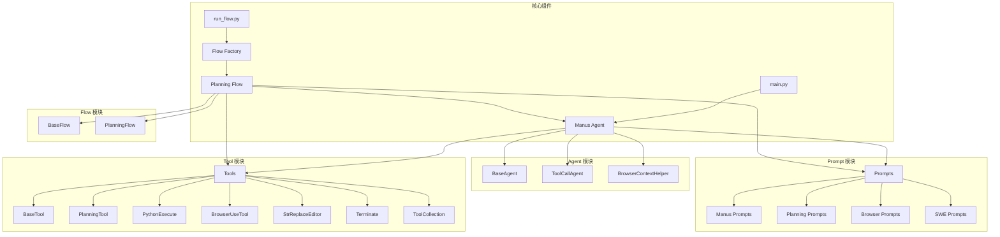
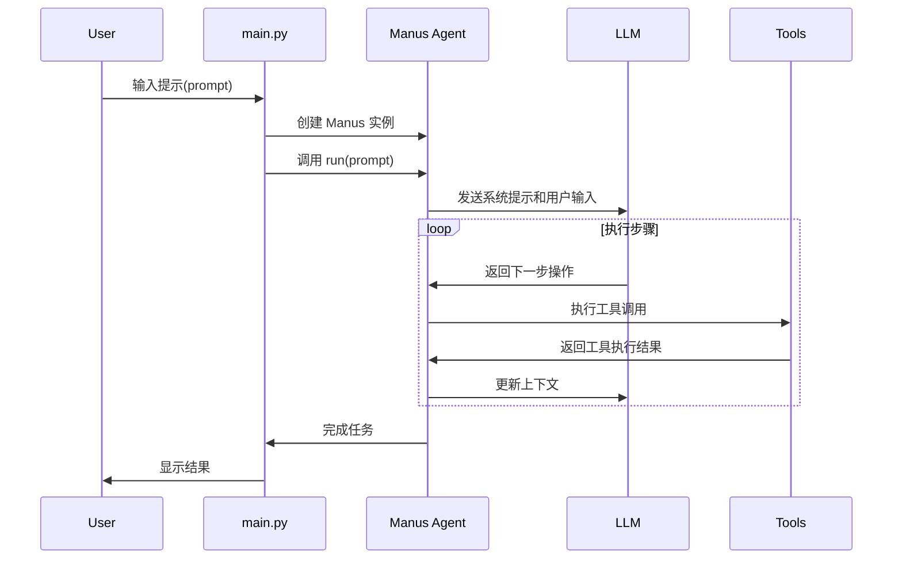
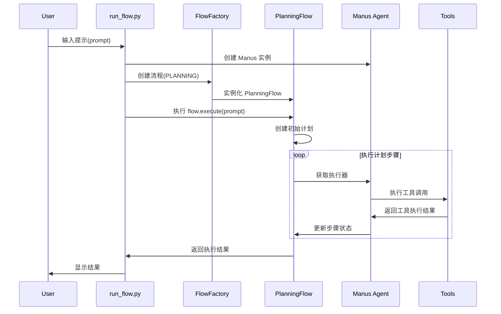
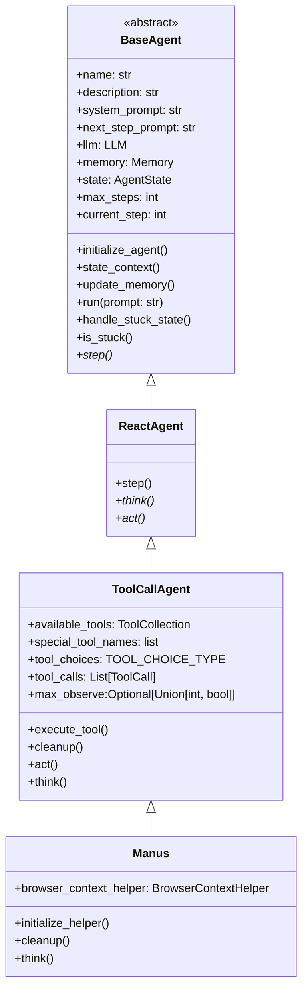
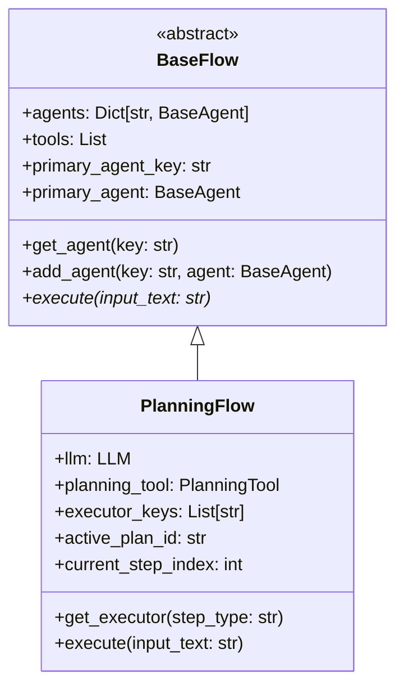
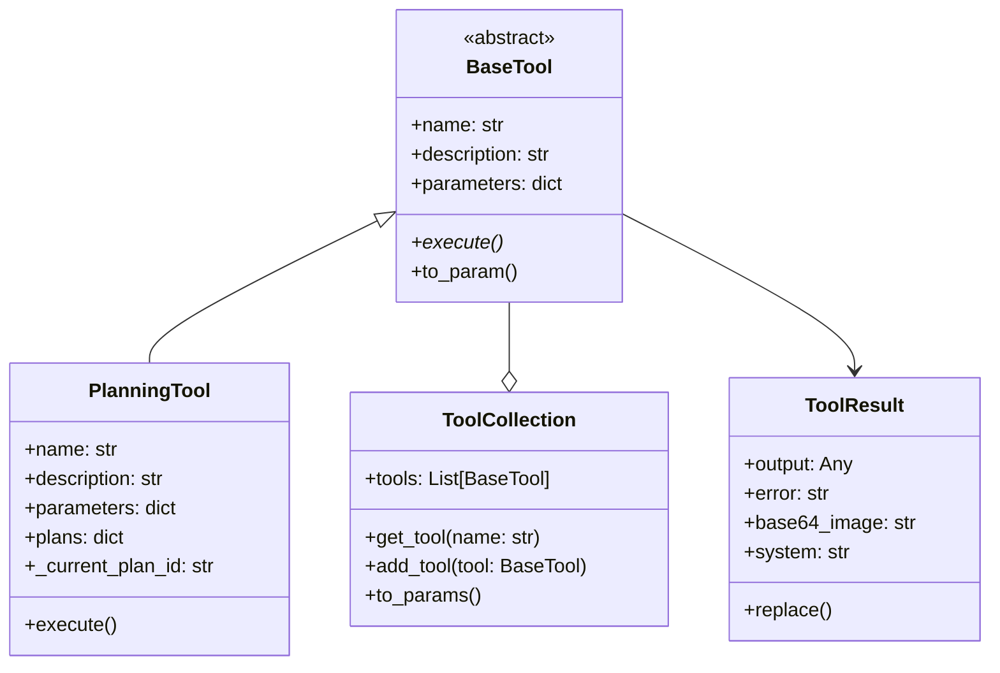
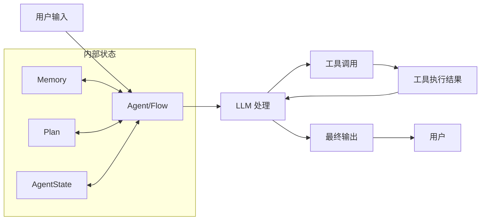

# OpenManus 项目架构图

本文档使用 Mermaid 图表展示 OpenManus 项目的架构、流程和类结构。

## 项目框架图



## 执行流程图

### main.py 执行流程



### run_flow.py 执行流程



## 类图

### Agent 类层次结构



### Flow 类层次结构



### Tool 类层次结构




## 数据流图




## 提示词
### 系统提示词

```
SYSTEM_PROMPT = (
    "你是OpenManus，一个全能的AI助手，旨在解决用户提出的任何任务。你拥有各种工具可以调用，以高效完成复杂的请求。无论是编程、信息检索、文件处理还是网页浏览，你都能胜任。"
    "初始目录是：{directory}"
)
```
### 用户提示词
#### 下一步提示词

```
NEXT_STEP_PROMPT = """
根据用户需求，主动选择最合适的工具或工具组合。对于复杂任务，你可以将问题分解，并逐步使用不同的工具来解决它。在使用每个工具后，清晰地解释执行结果并建议下一步操作。
"""
BROWSER_NEXT_STEP_PROMPT（如果最近的三个message中有使用BROWSER） = """
What should I do next to achieve my goal?

When you see [Current state starts here], focus on the following:
- Current URL and page title{url_placeholder}
- Available tabs{tabs_placeholder}
- Interactive elements and their indices
- Content above{content_above_placeholder} or below{content_below_placeholder} the viewport (if indicated)
- Any action results or errors{results_placeholder}

For browser interactions:
- To navigate: browser_use with action="go_to_url", url="..."
- To click: browser_use with action="click_element", index=N
- To type: browser_use with action="input_text", index=N, text="..."
- To extract: browser_use with action="extract_content", goal="..."
- To scroll: browser_use with action="scroll_down" or "scroll_up"

Consider both what's visible and what might be beyond the current viewport.
Be methodical - remember your progress and what you've learned so far.
"""
```


## ToolCallAgent
react模式的进行工具调用的Agent, 其act方法只负责工具的执行, 不负责思考

## Message的类型
- system: 系统消息
- user: 用户消息
- assistant: 助手消息
- tool: 工具消息

