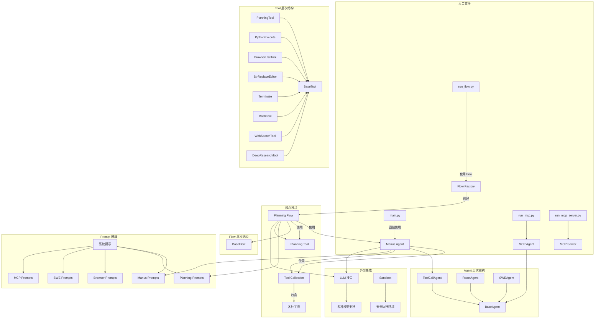
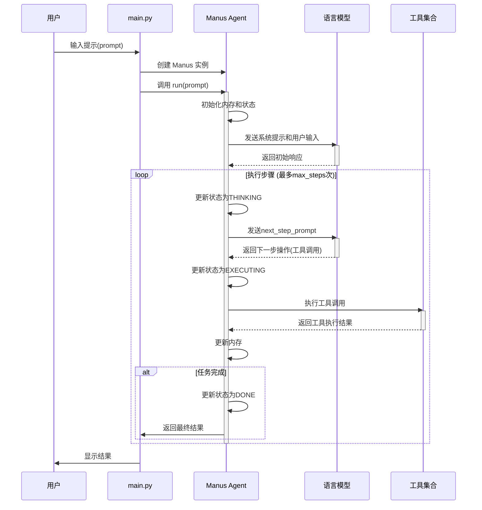
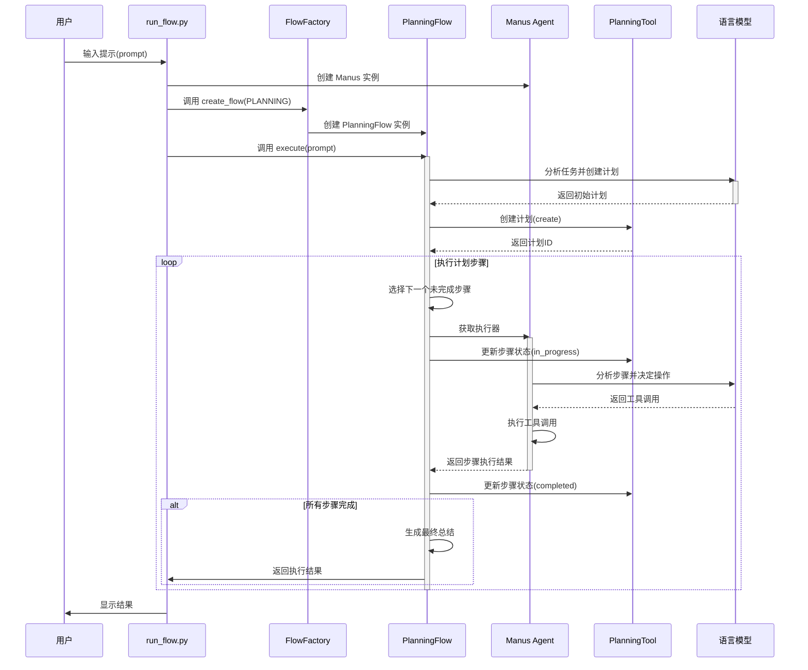
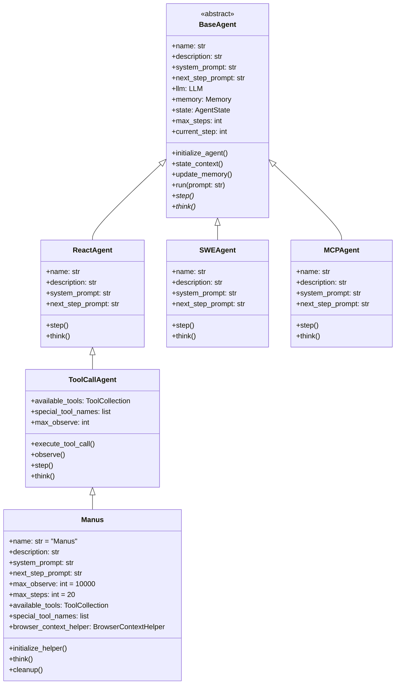
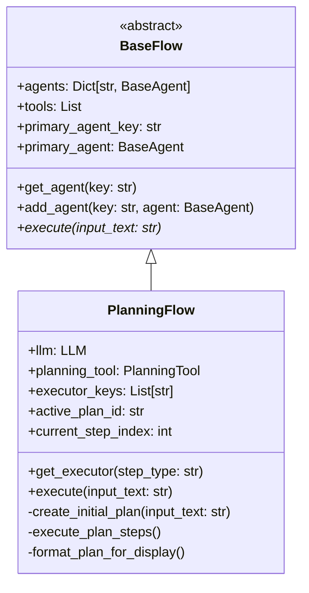
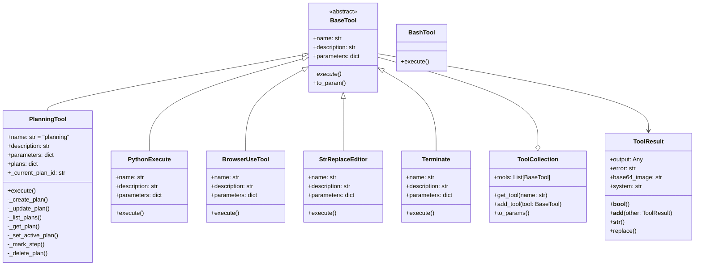
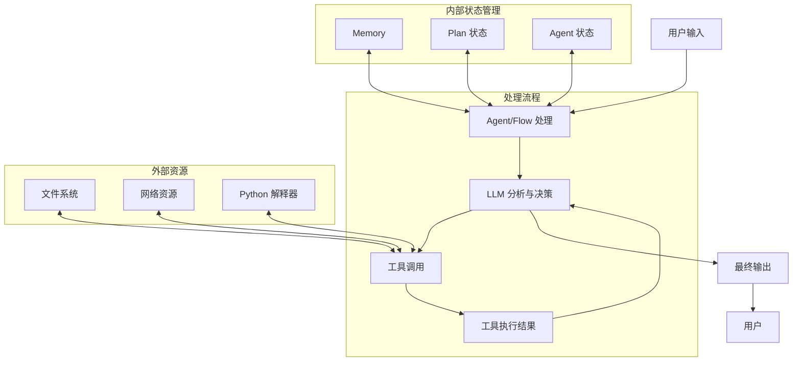
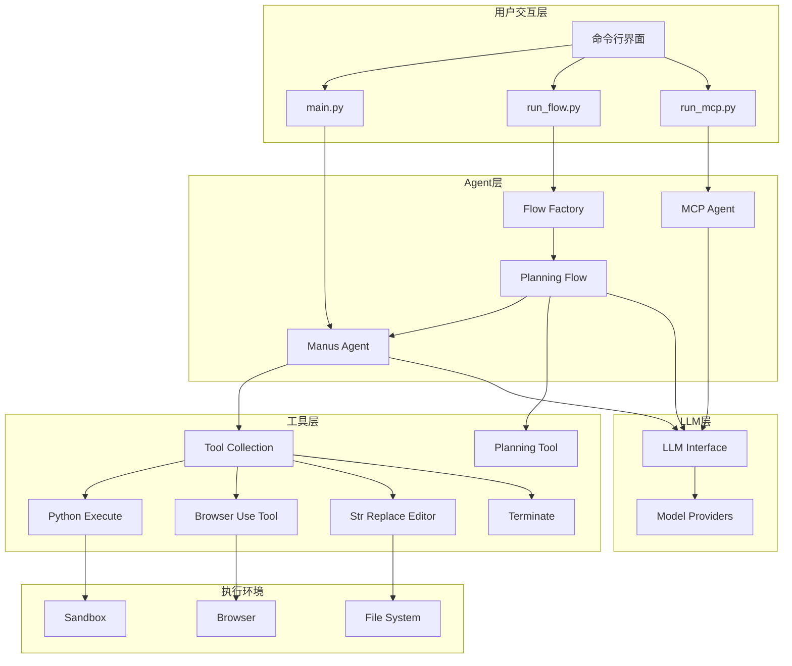

# OpenManus 项目详细架构图

本文档使用 Mermaid 图表详细展示 OpenManus 项目的架构、执行流程、类结构和组件交互。

## 项目整体架构



## 详细执行流程

### main.py 执行流程



### run_flow.py 执行流程



## 详细类图

### Agent 类层次结构



### Flow 类层次结构



### Tool 类层次结构



### function调用原理

``` python
def to_param(self) -> Dict:
        """Convert tool to function call format."""
        return {
            "type": "function",
            "function": {
                "name": self.name,
                "description": self.description,
                "parameters": self.parameters,
            },
        }
@abstractmethod
    async def execute(self, **kwargs) -> Any:
        """Execute the tool with given parameters."""
```

每个tool类型通过to_param方法转换为function call格式，然后作为参数传递给LLM。LLM根据用户输入和可用工具的参数，选择合适的工具进行调用。并且LLM会根据工具的参数类型，自动生成参数的schema，然后调用调用tool的execute方法。所以开发一个新的tool类型，只需要实现to_param所需的name、description和parameters（遵循openai协议）以及execute方法即可。
参考：https://github.com/mannaandpoem/OpenManus/blob/main/app/tool/bash.py

### mcp server调用原理

通过请求mcp server的api，mcp server 会返回一个json格式的response，response中包含了tool的name、description和parameters。这样就可以根据function call的原理，向模型发送这些信息，模型选择合适toolname和参数，将其发送给mcp，然后mcp server会根据tool的name，调用对应的tool的execute方法。
参考：https://github.com/mannaandpoem/OpenManus/blob/main/app/tool/mcp.py

## 数据流图



## 组件交互图



## 项目目录结构

```mermaid
graph TD
    A["OpenManus/"] --> B["app/"]
    A --> C["config/"]
    A --> D["examples/"]
    A --> E["tests/"]
    A --> F["main.py"]
    A --> G["run_flow.py"]
    A --> H["run_mcp.py"]
    A --> I["run_mcp_server.py"]

    B --> B1["agent/"]
    B --> B2["flow/"]
    B --> B3["prompt/"]
    B --> B4["tool/"]
    B --> B5["sandbox/"]
    B --> B6["mcp/"]
    B --> B7["__init__.py"]
    B --> B8["config.py"]
    B --> B9["llm.py"]
    B --> B10["logger.py"]
    B --> B11["schema.py"]
    B --> B12["exceptions.py"]

    B1 --> BA1["__init__.py"]
    B1 --> BA2["base.py"]
    B1 --> BA3["manus.py"]
    B1 --> BA4["react.py"]
    B1 --> BA5["swe.py"]
    B1 --> BA6["mcp.py"]
    B1 --> BA7["toolcall.py"]
    B1 --> BA8["browser.py"]

    B2 --> BB1["__init__.py"]
    B2 --> BB2["base.py"]
    B2 --> BB3["flow_factory.py"]
    B2 --> BB4["planning.py"]

    B3 --> BC1["__init__.py"]
    B3 --> BC2["manus.py"]
    B3 --> BC3["planning.py"]
    B3 --> BC4["browser.py"]
    B3 --> BC5["swe.py"]
    B3 --> BC6["mcp.py"]
    B3 --> BC7["toolcall.py"]
    B3 --> BC8["cot.py"]

    B4 --> BD1["__init__.py"]
    B4 --> BD2["base.py"]
    B4 --> BD3["planning.py"]
    B4 --> BD4["python_execute.py"]
    B4 --> BD5["browser_use_tool.py"]
    B4 --> BD6["str_replace_editor.py"]
    B4 --> BD7["terminate.py"]
    B4 --> BD8["bash.py"]
    B4 --> BD9["web_search.py"]
    B4 --> BD10["deep_research.py"]
    B4 --> BD11["tool_collection.py"]
```


